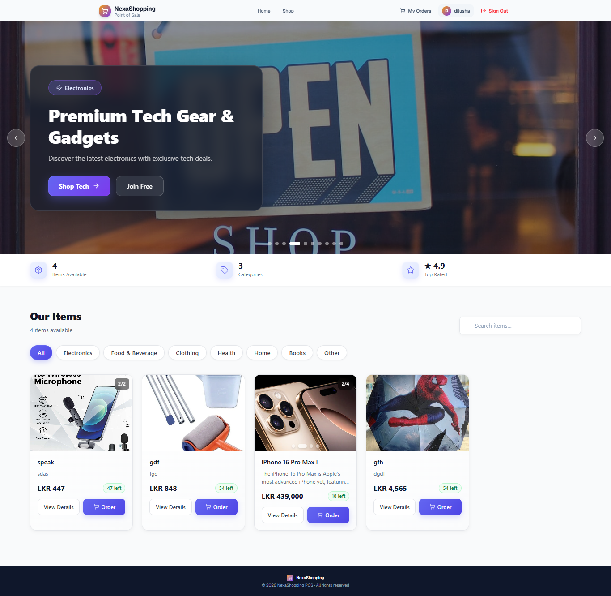
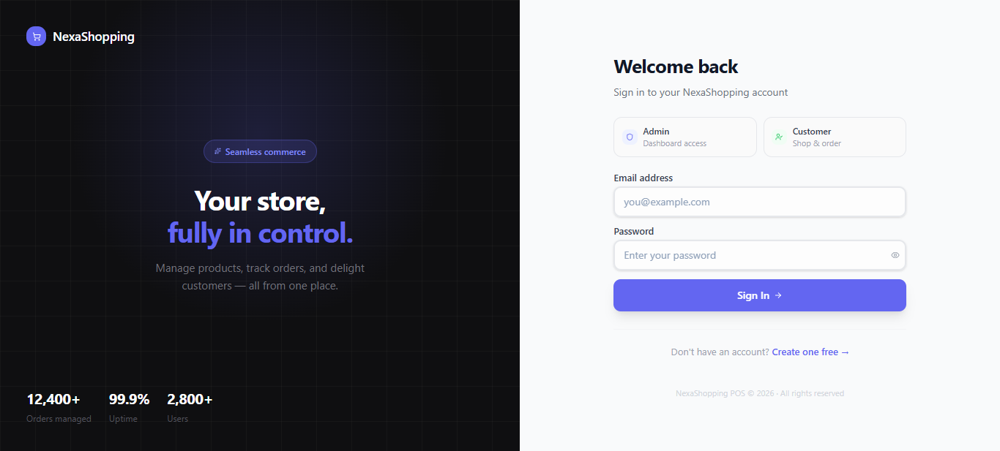
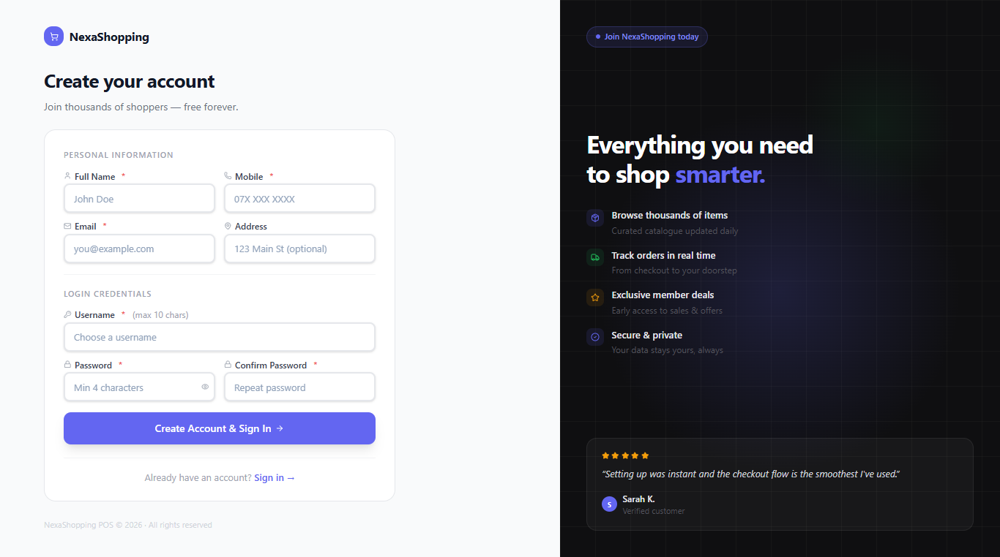
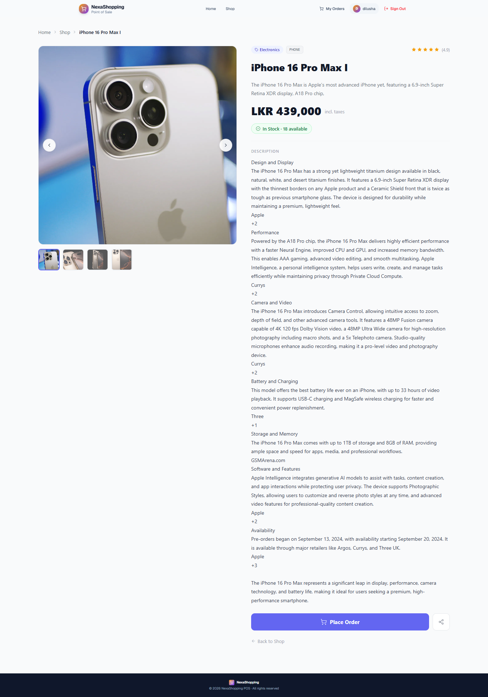
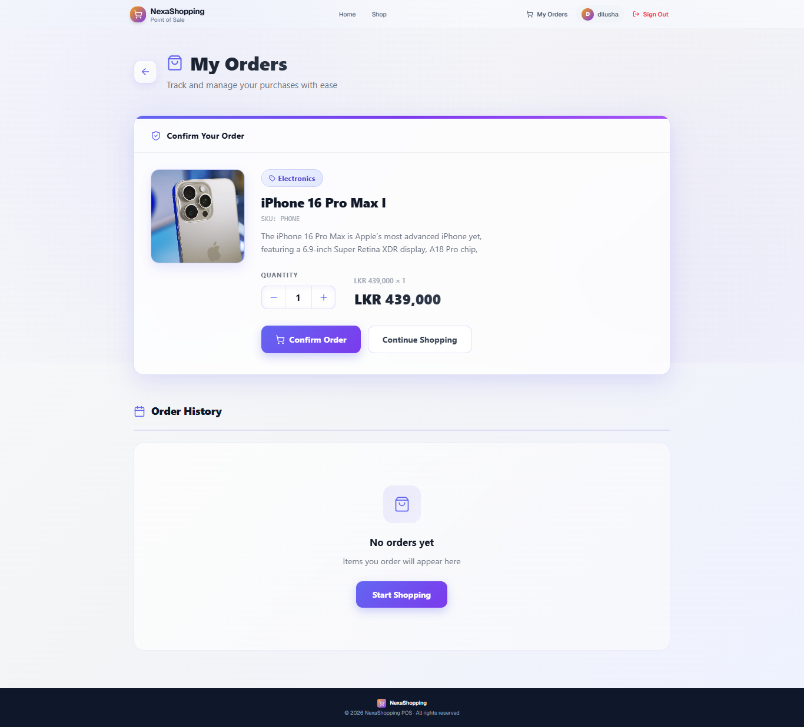
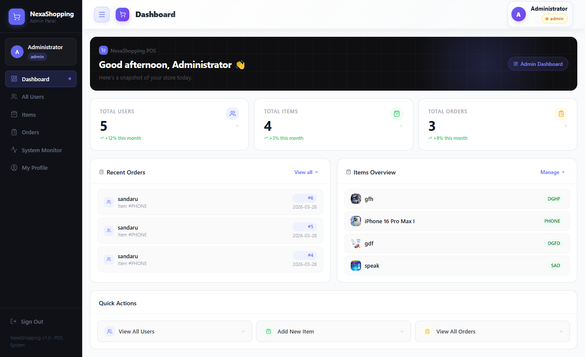
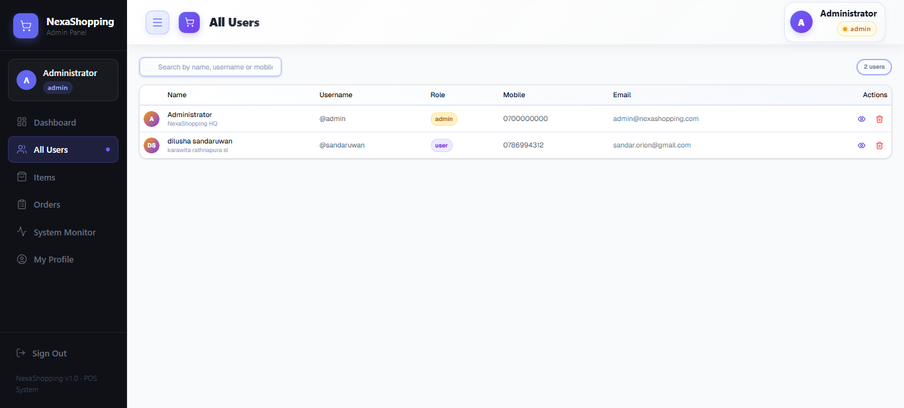
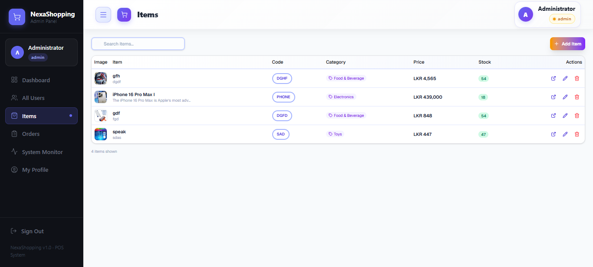
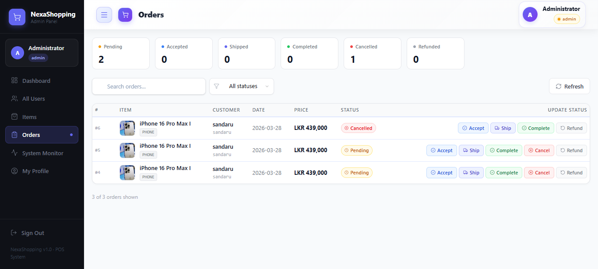
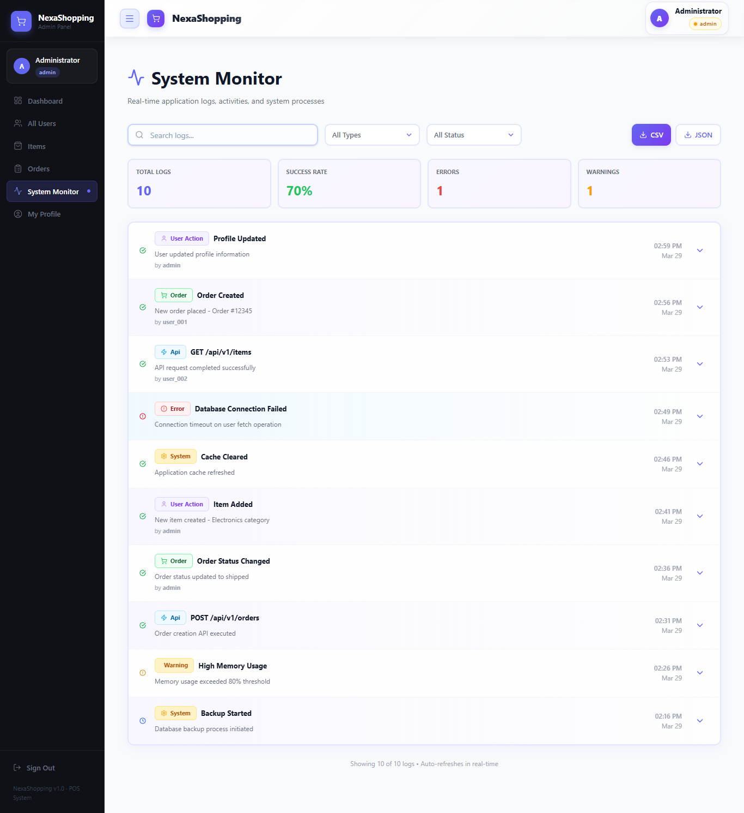

# NexaShopping Frontend Webapp

A **modern, responsive e-commerce web application** built with **Next.js 16**, **React 19**, and **TypeScript**. It provides a complete shopping experience with user management, product browsing, shopping cart functionality, and order management integrated with the NexaShopping microservices backend.

---

## 📋 Table of Contents

- [Overview](#overview)
- [Tech Stack](#tech-stack)
- [Features](#features)
- [Project Structure](#project-structure)
- [Setup & Installation](#setup--installation)
- [Running the Application](#running-the-application)
- [Configuration](#configuration)
- [Pages Overview](#pages-overview)
- [Components Guide](#components-guide)
- [API Integration](#api-integration)
- [State Management](#state-management)
- [Form Handling](#form-handling)
- [Styling](#styling)
- [Development Guide](#development-guide)
- [Troubleshooting](#troubleshooting)

---

## 🎯 Overview

**NexaShopping Frontend** is a cutting-edge e-commerce application that:

- ✅ Provides **responsive, modern UI** for shopping
- ✅ Integrates with **microservices backend** via API Gateway
- ✅ Manages **user accounts** and profiles
- ✅ Displays **product catalog** with filters
- ✅ Handles **shopping cart** functionality
- ✅ Manages **orders** and order history
- ✅ Supports **dark/light** theme switching
- ✅ Built with **TypeScript** for type safety
- ✅ Uses **Component-driven** architecture

**URL**: http://localhost:3000  
**Framework**: Next.js 16 (App Router)  
**Language**: TypeScript  
**Node.js**: 18+ required

---

## 🛠️ Tech Stack

### Frontend Framework
| Technology | Version | Purpose |
|-----------|---------|---------|
| **Next.js** | 16.1.6 | React framework with SSR and SSG |
| **React** | 19.2.3 | UI component library |
| **TypeScript** | 5 | Type-safe JavaScript |

### Styling & UI
| Technology | Purpose |
|-----------|---------|
| **Tailwind CSS** | 4 | Utility-first CSS framework |
| **ShadCN UI** | Radix UI component library |
| **Lucide React** | Icon set (500+ icons) |
| **Class Variance Authority** | Utility for managing component variants |
| **Tailwind Merge** | Merge Tailwind CSS classes |

### Form & Data
| Technology | Version | Purpose |
|-----------|---------|---------|
| **React Hook Form** | 7.71.2 | Efficient form state management |
| **Zod** | 4.3.6 | TypeScript-first schema validation |
| **date-fns** | 4.1.0 | Date parsing and formatting |

### HTTP & Notifications
| Technology | Purpose |
|-----------|---------|
| **Axios** | 1.13.6 - HTTP client for API calls |
| **Sonner** | Toast notifications |

### Theme Management
| Technology | Purpose |
|-----------|---------|
| **next-themes** | Dark/light mode switching |

---

## ✨ Features

### Authentication Pages
- **Login** (`/(auth)/login`) - User authentication
- **Register** (`/(auth)/register`) - New user registration
- **Protected Routes** - Auth guard for dashboard pages

### Main Pages
| Page | Route | Description | Features |
|------|-------|-------------|----------|
| **Home/Shop** | `/shop` | Product catalog | Browse, filter, add to cart |
| **Items** | `/items` | All products admin view | CRUD operations for items |
| **Users** | `/users` | User management | View, edit, delete users |
| **Profile** | `/profile` | User profile page | View/edit user information |
| **Orders** | `/orders` | Browse all orders | View orders |
| **My Orders** | `/my-orders` | User's orders | View personal order history |
| **Dashboard** | `/dashboard` | Admin dashboard | Statistics and quick actions |

### UI Components
- **Buttons** with variants (primary, secondary, destructive)
- **Cards** for content grouping
- **Forms** with validation
- **Tables** for data display
- **Dialogs** for confirmations
- **Dropdowns** for menus
- **Badges** for status indicators
- **Avatars** for user profiles
- **Alerts** for messages
- **Toast notifications** via Sonner
- **Skeleton loaders** for loading states
- **Tabs** for content organization
- **Selects** for dropdowns

---

## 📁 Project Structure

```
webapp/
├── app/                          # Next.js App Router directory
│   ├── page.tsx                  # Home page (redirect to /shop)
│   ├── layout.tsx                # Root layout (Sidebar + Header)
│   ├── globals.css               # Global styles
│   ├── layout-shell.tsx          # Layout with sidebar shell
│   │
│   ├── (auth)/                   # Authentication routes (no layout)
│   │   ├── login/page.tsx        # Login page
│   │   └── register/page.tsx     # Registration page
│   │
│   ├── dashboard/                # Admin dashboard
│   │   └── page.tsx              # Dashboard overview
│   │
│   ├── users/                    # User management
│   │   └── page.tsx              # User list & CRUD
│   │
│   ├── items/                    # Item/Product management
│   │   └── page.tsx              # Item list & CRUD
│   │
│   ├── shop/                     # Shopping pages
│   │   ├── page.tsx              # Shop/catalog page
│   │   └── [id]/page.tsx         # Item detail page
│   │
│   ├── orders/                   # Order pages
│   │   └── page.tsx              # All orders view
│   │
│   ├── my-orders/                # User's orders
│   │   └── page.tsx              # Personal order history
│   │
│   ├── profile/                  # User profile
│   │   └── page.tsx              # Profile page
│   │
│   ├── students/                 # Legacy student pages
│   │   └── page.tsx              # Student management
│   │
│   └── favicon.ico               # Favicon

├── components/                   # Reusable React components
│   ├── auth/                     # Authentication components
│   │   └── auth-guard.tsx        # Protected route wrapper
│   │
│   ├── items/                    # Item/product components
│   │   └── item-form.tsx         # Create/edit item form
│   │
│   ├── layout/                   # Layout components
│   │   ├── header.tsx            # Top navigation header
│   │   ├── public-nav.tsx        # Public navigation
│   │   └── sidebar.tsx           # Side navigation
│   │   └── sidebar-context.tsx   # Sidebar state context
│   │
│   ├── orders/                   # Order components
│   │   └── order-details.tsx     # Order information display
│   │
│   ├── students/                 # Student components
│   │   └── student-form.tsx      # Student create/edit form
│   │
│   └── ui/                       # Base UI components (ShadCN)
│       ├── alert-dialog.tsx      # Confirmation dialogs
│       ├── avatar.tsx            # User avatars
│       ├── badge.tsx             # Status badges
│       ├── button.tsx            # Button component
│       ├── card.tsx              # Card container
│       ├── dialog.tsx            # Modal dialog
│       ├── dropdown-menu.tsx     # Dropdown menus
│       ├── form.tsx              # Form wrapper
│       ├── input.tsx             # Text input field
│       ├── label.tsx             # Form label
│       ├── select.tsx            # Select dropdown
│       ├── separator.tsx         # Visual separator
│       ├── skeleton.tsx          # Loading skeleton
│       ├── sonner.tsx            # Toast provider
│       ├── table.tsx             # Data table
│       ├── tabs.tsx              # Tab component
│       └── textarea.tsx          # Multi-line text input

├── lib/                          # Utility functions & hooks
│   ├── api.ts                    # API client (Axios + interceptors)
│   ├── auth.ts                   # Authentication utilities
│   └── utils.ts                  # Helper functions (cn, classnames)

├── types/                        # TypeScript types & interfaces
│   └── index.ts                  # Shared type definitions

├── public/                       # Static assets
│   ├── images/                   # Image files
│   └── icons/                    # Icon files

├── .env.local                    # Environment variables (not in git)
├── next.config.ts                # Next.js configuration
├── next-env.d.ts                 # Next.js TypeScript definitions
├── tsconfig.json                 # TypeScript configuration
├── tailwind.config.ts            # Tailwind CSS configuration
├── postcss.config.mjs            # PostCSS configuration
├── components.json               # ShadCN configuration
├── eslint.config.mjs             # ESLint configuration
├── package.json                  # Dependencies & scripts
├── package-lock.json             # Locked dependency versions
└── README.md                     # This file
```

---

## 🚀 Setup & Installation

### Prerequisites

- **Node.js 18+** (verify with `node --version`)
- **npm 9+** or **yarn** (verify with `npm --version`)
- **Git** for cloning repository
- **API Gateway** running on port 7000

### Installation Steps

**1. Clone the repository**
```bash
git clone <repository-url>
cd NexaShopping-Project/webapp
```

**2. Install dependencies**
```bash
npm install
# or
yarn install
```

**3. Configure environment variables**
```bash
# Create .env.local file
cp .env.example .env.local  # if example exists, or create manually

# Edit .env.local with your settings
echo "NEXT_PUBLIC_API_BASE_URL=http://localhost:7000" > .env.local
echo "NEXT_PUBLIC_API_TIMEOUT=30000" >> .env.local
```

**4. Verify setup**
```bash
# Check Node version
node --version  # Should be 18+

# Check dependencies installed
npm list --depth=0
```

---

## ▶️ Running the Application

### Development Mode (Recommended)

```bash
npm run dev
# or
yarn dev
```

**Output:**
```
  ▲ Next.js 16.1.6
  - Environments: .env.local

  ✓ Ready in 2.5s
  ➜  Local:        http://localhost:3000
  ➜  Blocks:       disabled
  ➜  Instrumentation: disabled
```

Visit: http://localhost:3000

### Production Build

```bash
# Build the application
npm run build

# Start production server
npm run start
```

### Lint & Format

```bash
# Run ESLint
npm run lint

# Fix ESLint issues
npm run lint --fix
```

---

## ⚙️ Configuration

### Environment Variables (.env.local)

```env
# API Gateway Configuration
NEXT_PUBLIC_API_BASE_URL=http://localhost:7000
NEXT_PUBLIC_API_TIMEOUT=30000

# Optional: Add more services if needed
NEXT_PUBLIC_USER_SERVICE_URL=http://localhost:8001
NEXT_PUBLIC_ITEM_SERVICE_URL=http://localhost:8002
NEXT_PUBLIC_ORDER_SERVICE_URL=http://localhost:8003
```

### next.config.ts

```typescript
const nextConfig: NextConfig = {
  images: {
    remotePatterns: [
      {
        protocol: "http",
        hostname: "localhost",
        port: "7000",
        pathname: "/api/v1/**",  // Allow images from API Gateway
      },
      {
        protocol: "https",
        hostname: "*.unsplash.com",  // Allow Unsplash images
      },
    ],
  },
};
```

### Tailwind Configuration

Configured in `tailwind.config.ts` with:
- Extended colors
- Custom fonts
- Animation utilities
- Dark mode support

---

## � Screenshots & Page Gallery

### User Journey

#### 1️⃣ **Home Page** - Shopping Hub
The main landing page showcasing the product catalog with hero slider, featured categories, and quick navigation.
```
Route: / → redirects to /shop
Features: Hero slider, category filters, product grid, search functionality
```


---

#### 2️⃣ **Authentication Pages**

##### Login Page
User authentication with email/password credentials and link to registration.
```
Route: /(auth)/login
Features: Form validation, "Remember me", password recovery link, signup redirect
```


##### Register Page
New user account creation with email, password, and profile information.
```
Route: /(auth)/register
Features: Form validation, password strength indicator, terms acceptance, login redirect
```


---

#### 3️⃣ **Shopping Pages**

##### Product Detail Page
View detailed information about a specific product with images, description, price, and add-to-cart option.
```
Route: /shop/[id]
Features: Image gallery, product specs, pricing, quantity selector, reviews, related items
Example: /shop/PHONE
```


##### My Orders Page
Personal order history for the logged-in user with status tracking and reorder options.
```
Route: /my-orders
Features: Order list, status badges, order details modal, reorder option, order timeline
```


---

#### 4️⃣ **Admin Pages** - Dashboard & Management

##### Admin Dashboard
Overview of key metrics, recent orders, inventory status, and quick actions.
```
Route: /dashboard (Admin only)
Features: Stats cards, recent orders list, inventory overview, quick action buttons, performance charts
```


##### Users Management
Complete user management interface for admins - view, create, edit, and delete user accounts.
```
Route: /users (Admin only)
Features: User table, bulk actions, search/filter, user creation form, role assignment
```


##### Items/Products Management
Admin interface to manage product catalog - create, edit, delete items with images and pricing.
```
Route: /items (Admin only)
Features: Product table, bulk actions, create/edit modal, image upload (base64), category tagging
```


##### Orders Management
Comprehensive view of all orders in the system with filtering, search, and status updates.
```
Route: /orders (Admin only)
Features: Order table, status filtering, order details, customer information, timeline view
```


---

#### 5️⃣ **System Monitor** - Monitoring & Analytics
Real-time system monitoring dashboard showing application logs, API activity, and system health.
```
Route: /system-monitor (Admin only)
Features: Live logs, filtering by type/status, export (CSV/JSON), performance metrics, activity timeline
```


---

## �📄 Pages Overview

### Public Pages (No Authentication Required)

#### Home/Shop Page (`/shop`)
- **Purpose**: Browse and shop products
- **Features**:
  - Product catalog with grid layout
  - Search and filter functionality
  - Add to cart
  - View product details
  - Image gallery per product

#### Item Details (`/shop/[id]`)
- **Purpose**: View detailed product information
- **Features**:
  - Full product details
  - High-quality images
  - Price and stock information
  - Add to cart
  - Related products

#### Login (`/(auth)/login`)
- **Purpose**: User authentication
- **Features**:
  - Email login
  - Password input
  - Remember me option
  - Redirect to dashboard on success
  - Registration link

#### Register (`/(auth)/register`)
- **Purpose**: New user account creation
- **Features**:
  - User information form
  - Profile picture upload
  - Email validation
  - Password confirmation
  - Auto-login after registration

### Protected Pages (Authentication Required)

#### Dashboard (`/dashboard`)
- **Purpose**: Admin overview and statistics
- **Features**:
  - User count statistics
  - Product count statistics
  - Total orders count
  - Recent orders list
  - Quick action buttons

#### Users (`/users`)
- **Purpose**: User management
- **Features**:
  - List all users
  - Create new user
  - Edit user details
  - Delete users
  - User search/filter

#### Items (`/items`)
- **Purpose**: Product management
- **Features**:
  - List all products
  - Create new product
  - Edit product details
  - Delete products
  - Category management

#### Orders (`/orders`)
- **Purpose**: View all orders
- **Features**:
  - Order list with pagination
  - Order details view
  - Order status
  - User and item information
  - Filter/search orders

#### My Orders (`/my-orders`)
- **Purpose**: View user's personal orders
- **Features**:
  - User's order history
  - Order date and total
  - Order status
  - Quick reorder functionality

#### Profile (`/profile`)
- **Purpose**: User profile management
- **Features**:
  - View/edit personal information
  - Profile picture
  - Contact details
  - Account settings
  - Change password

---

## 🧩 Components Guide

### Layout Components

#### Header (`components/layout/header.tsx`)
- Sticky top navigation
- Logo/branding
- Search bar
- User menu (profile, logout)
- Cart icon with badge

#### Sidebar (`components/layout/sidebar.tsx`)
- Fixed left sidebar
- Navigation menu (collapsible)
- Active page indicator
- Logo section
- Links to all main pages

#### Public Navigation (`components/layout/public-nav.tsx`)
- Navigation for public pages (login, register, shop)
- Top header bar
- Cart link

### Authentication Components

#### Auth Guard (`components/auth/auth-guard.tsx`)
- Protects routes from unauthorized access
- Redirects to login if not authenticated
- Checks authentication token
- Loads user information

### Form Components

#### Item Form (`components/items/item-form.tsx`)
- Create/edit product form
- Fields: name, description, price, stock, images
- Image upload handling
- Form validation with Zod
- Error messages

#### Student Form (`components/students/student-form.tsx`)
- Create/edit user form
- Fields: name, email, phone, profile picture
- File upload handling
- Form validation

### Order Components

#### Order Details (`components/orders/order-details.tsx`)
- Display order information
- Order items
- Customer information
- Order status
- Order total

### Base UI Components (from ShadCN)
- Button - Click actions
- Card - Content containers
- Dialog - Modals and confirmations
- Form - Form wrapper with validation
- Input - Text inputs
- Label - Form labels
- Select - Dropdown selections
- Table - Data display
- Alert Dialog - Delete confirmations
- Avatar - User profile pictures
- Badge - Status indicators
- Toast - Notifications (via Sonner)

---

## 🔗 API Integration

### API Client Configuration (`lib/api.ts`)

```typescript
import axios from 'axios';

const apiClient = axios.create({
  baseURL: process.env.NEXT_PUBLIC_API_BASE_URL || 'http://localhost:7000',
  timeout: parseInt(process.env.NEXT_PUBLIC_API_TIMEOUT || '30000'),
  headers: {
    'Content-Type': 'application/json',
  },
});

// Request interceptor - add auth token
apiClient.interceptors.request.use((config) => {
  const token = localStorage.getItem('authToken');
  if (token) {
    config.headers.Authorization = `Bearer ${token}`;
  }
  return config;
});

// Response interceptor - handle errors
apiClient.interceptors.response.use(
  (response) => response,
  (error) => {
    if (error.response?.status === 401) {
      // Redirect to login
      window.location.href = '/login';
    }
    return Promise.reject(error);
  }
);
```

### Backend Endpoints

#### User Service (via API Gateway)
```
POST   /api/v1/users              - Create user
GET    /api/v1/users              - List users
GET    /api/v1/users/{id}         - Get user detail
PUT    /api/v1/users/{id}         - Update user
DELETE /api/v1/users/{id}         - Delete user
GET    /api/v1/users/{id}/picture - Get profile picture
```

#### Item Service (via API Gateway)
```
POST   /api/v1/items      - Create item
GET    /api/v1/items      - List items
GET    /api/v1/items/{id} - Get item detail
PUT    /api/v1/items/{id} - Update item
DELETE /api/v1/items/{id} - Delete item
```

#### Order Service (via API Gateway)
```
POST   /api/v1/orders              - Create order
GET    /api/v1/orders              - List orders
GET    /api/v1/orders/{id}         - Get order detail
GET    /api/v1/orders?itemId={id}  - Filter orders
PUT    /api/v1/orders/{id}         - Update order
DELETE /api/v1/orders/{id}         - Delete order
```

### Example API Call

```typescript
import { apiClient } from '@/lib/api';

// Get all users
const response = await apiClient.get('/api/v1/users');
const users = response.data.map(user => ({
  id: user.nic,
  name: user.name,
  email: user.email,
  picture: user.picture,
}));

// Create new order
const newOrder = await apiClient.post('/api/v1/orders', {
  date: new Date().toISOString(),
  userId: 'USER001',
  itemId: 'ITEM001',
});
```

---

## 🧠 State Management

### Context API
- **SidebarContext** - Sidebar open/close state
- **AuthContext** (optional) - User authentication state

### Local Storage
- **authToken** - JWT token for authentication
- **cartItems** - Shopping cart items
- **userPreferences** - User settings (theme, layout)

### React Hooks
- **useState** - Component state
- **useEffect** - Side effects
- **useContext** - Context consumption
- **useRouter** - Navigation

---

## 📝 Form Handling

### React Hook Form + Zod Integration

```typescript
import { useForm } from 'react-hook-form';
import { zodResolver } from '@hookform/resolvers/zod';
import { z } from 'zod';

// Define validation schema
const userSchema = z.object({
  name: z.string().min(2, 'Name must be at least 2 characters'),
  email: z.string().email('Invalid email'),
  phone: z.string().min(10, 'Phone must be at least 10 digits'),
});

type UserFormData = z.infer<typeof userSchema>;

// Use in component
export function UserForm() {
  const form = useForm<UserFormData>({
    resolver: zodResolver(userSchema),
  });

  const onSubmit = async (data: UserFormData) => {
    try {
      await apiClient.post('/api/v1/users', data);
      // Success toast
    } catch (error) {
      // Error handling
    }
  };

  return (
    <form onSubmit={form.handleSubmit(onSubmit)}>
      {/* Form fields */}
    </form>
  );
}
```

---

## 🎨 Styling

### Tailwind CSS
- **Utility-first** approach
- **Dark mode** support with `next-themes`
- **Responsive** design with breakpoints
- Custom **spacing, colors, fonts**

### CSS Classes

```typescript
// Using cn() utility from lib/utils.ts
import { cn } from '@/lib/utils';

export function Component() {
  return (
    <div className={cn(
      "base-styles",
      isActive && "active-styles",
      variant === 'primary' && "primary-styles"
    )}>
      Content
    </div>
  );
}
```

### Dark Mode

```typescript
'use client';

import { ThemeProvider } from 'next-themes';

export function RootLayout({ children }) {
  return (
    <ThemeProvider attribute="class">
      {children}
    </ThemeProvider>
  );
}
```

---

## 👨‍💻 Development Guide

### Adding a New Page

1. **Create page file** in `app/` or subdirectory:
```typescript
// app/new-page/page.tsx
'use client';

export default function NewPage() {
  return (
    <div>
      <h1>New Page</h1>
    </div>
  );
}
```

2. **Add navigation link** in `components/layout/sidebar.tsx`:
```typescript
{ href: '/new-page', label: 'New Page', icon: Icon }
```

3. **Add layout wrapper** if needed:
```typescript
// app/new-page/layout.tsx
export default function Layout({ children }) {
  return <div className="container">{children}</div>;
}
```

### Adding a New Component

1. **Create component file**:
```typescript
// components/new-component.tsx
'use client';

import { ReactNode } from 'react';

interface NewComponentProps {
  title: string;
  children: ReactNode;
}

export function NewComponent({ title, children }: NewComponentProps) {
  return (
    <div>
      <h2>{title}</h2>
      {children}
    </div>
  );
}
```

2. **Use in page**:
```typescript
import { NewComponent } from '@/components/new-component';

export default function Page() {
  return <NewComponent title="Hello">Content</NewComponent>;
}
```

### Adding a New API Call

1. **Create helper function** in `lib/api.ts`:
```typescript
export const getUserById = (id: string) => {
  return apiClient.get(`/api/v1/users/${id}`);
};
```

2. **Use in component**:
```typescript
const { data: user } = await getUserById('USER001');
```

### Code Standards

- **TypeScript**: Use proper typing for all functions
- **Component naming**: PascalCase for components
- **Function naming**: camelCase for functions
- **Folder structure**: Organized by feature
- **Comments**: Document complex logic
- **Error handling**: Always handle API errors
- **Loading states**: Show loaders during data fetch

---

## 🐛 Troubleshooting

### Issue 1: Build Fails

**Error**: `npm ERR! code ERESOLVE`

**Solution**:
```bash
# Clear cache and reinstall
rm -rf node_modules package-lock.json
npm install

# Or use legacy dependency resolution
npm install --legacy-peer-deps
```

### Issue 2: API Calls Fail (CORS Error)

**Error**: `Access to XMLHttpRequest blocked by CORS policy`

**Solutions**:
1. Verify API Gateway is running on port 7000
2. Check `.env.local` has correct `NEXT_PUBLIC_API_BASE_URL`
3. Verify CORS is configured in API Gateway
4. Check network tab in DevTools

### Issue 3: Images Not Loading

**Error**: `Image optimization failed` or blank image

**Solutions**:
1. Check `next.config.ts` has correct remote patterns
2. Verify image URL is accessible
3. Check image format (JPEG, PNG, WebP)
4. Verify API Gateway image endpoint works

### Issue 4: Authentication Issues

**Error**: `Redirected to login unexpectedly`

**Solutions**:
1. Check auth token in localStorage
2. Verify token format and expiration
3. Check API Gateway auth endpoints
4. Clear localStorage and re-login

### Issue 5: Port Already in Use

**Error**: `Port 3000 is already in use`

**Solution**:
```bash
# Use different port
npm run dev -- -p 3001

# Or kill process using port 3000
# macOS/Linux
lsof -i :3000
kill -9 <PID>

# Windows
netstat -ano | findstr :3000
taskkill /PID <PID> /F
```

### Issue 6: Hot Reload Not Working

**Issue**: Changes not reflected in browser

**Solution**:
1. Check file was saved
2. Restart dev server (`npm run dev`)
3. Clear `.next` folder: `rm -rf .next`
4. Clear browser cache

---

## 📊 Performance Tips

1. **Image Optimization**: Use Next.js Image component
2. **Code Splitting**: Automatic with App Router
3. **Lazy Loading**: Use dynamic imports for heavy components
4. **API Caching**: Implement SWR or React Query (optional)
5. **Bundle Analysis**: Check build output size

---

## 📚 References

- [Next.js Documentation](https://nextjs.org/docs)
- [React Documentation](https://react.dev)
- [TypeScript Documentation](https://www.typescriptlang.org/docs/)
- [Tailwind CSS Documentation](https://tailwindcss.com/docs)
- [ShadCN UI](https://ui.shadcn.com/)
- [React Hook Form](https://react-hook-form.com/)
- [Zod Validation](https://zod.dev/)

---

## 📝 Notes

- **Client Components**: Use `'use client'` for interactivity
- **Server Components**: Default in Next.js 13+ for performance
- **API Routes**: Not used (calls API Gateway instead)
- **Static Files**: Place in `/public` directory
- **Environment Variables**: Prefix with `NEXT_PUBLIC_` to expose to browser

---

## 🤝 Support

For issues or questions:
1. Check service-specific documentation
2. Review troubleshooting section
3. Check browser console for errors
4. Verify backend services are running
5. Check network tab in DevTools

---

## 📄 License

This project is part of the Enterprise Cloud Application (ECA) module in the Higher Diploma in Software Engineering (HDSE) program at the Institute of Software Engineering (IJSE).

---

**Last Updated**: March 19, 2026  
**Version**: 1.0.0  
**Node.js**: 18+ required  
**npm**: 9+ required
│   ├── programs/
│   │   └── program-form.tsx  # Program create/edit form
│   └── enrollments/
│       └── enrollment-form.tsx # Enrollment create/edit form
├── lib/
│   └── api.ts                # Axios API client (studentApi, programApi, enrollmentApi)
├── types/
│   └── index.ts              # Shared TypeScript types
└── .env.local                # Environment variables
```

## Environment Variables

Create a `.env.local` file in the `webapp/` directory:

```env
NEXT_PUBLIC_API_GATEWAY_URL=http://localhost:7000
```

## Getting Started

Follow the lecture guidelines, refer to the lecture video for more information and how to get started correctly.

> **Prerequisites:** All backend services (Config-Server, Service-Registry, Api-Gateway, Student-Service, Program-Service, Enrollment-Service) must be running before starting the webapp.

**Full startup order:**
1. Config-Server (`9000`)
2. Service-Registry (`9001`)
3. Api-Gateway (`7000`)
4. Student-Service (`8000`)
5. Program-Service (`8001`)
6. Enrollment-Service (`8002`)
7. **Webapp** (`3000`)

Install dependencies:

```bash
npm install
```

Start the development server:

```bash
npm run dev
```

The application will be available at: `http://localhost:3000`

## Need Help?

If you encounter any issues, feel free to reach out and start a discussion via the Slack workspace.
